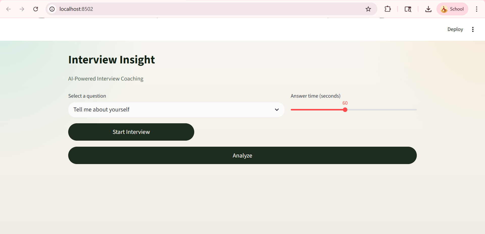
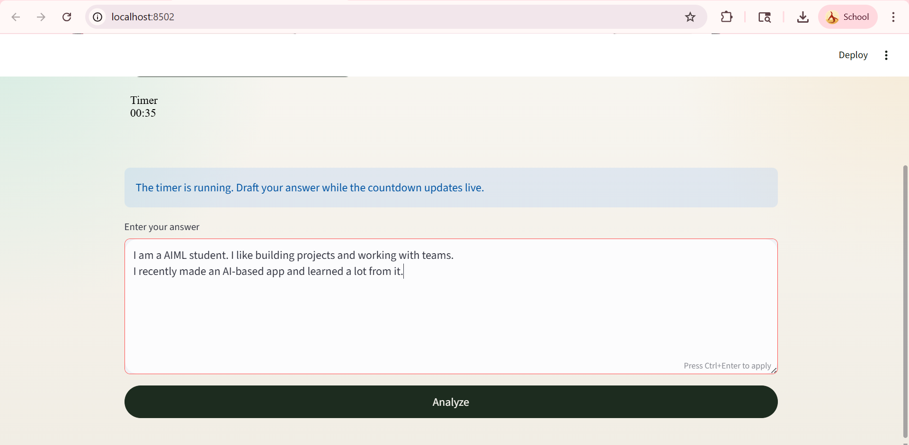
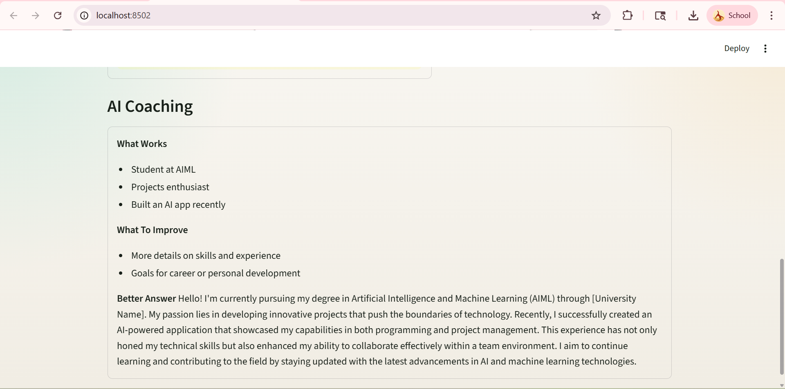

# Interview Insight

**Interview Insight** is an AI-powered interview coaching app built with **Streamlit**. It helps users practice common interview questions, write timed responses, and receive instant feedback on answer quality, tone, structure, keyword coverage, and AI-generated coaching.

This project is valuable because it combines **fast rule-based analysis** with **LLM-generated feedback** in a lightweight interface. Instead of only rewriting an answer, it gives users a clearer sense of what worked, what needs improvement, and how a stronger response could sound.

## Overview

- Practice interview answers in a timed environment
- Review filler-word count, sentiment, structure, and keyword match
- Generate AI coaching with:
  - **What Works**
  - **What To Improve**
  - **Better Answer**
- Use a clean, minimal Streamlit interface designed for quick practice

## Demo

- **GitHub Repository:** [khushiverse/ai-interview-analyser](https://github.com/khushiverse/ai-interview-analyser)
- **Live Demo:** Add your deployed app link here
- **Video Walkthrough:** Add a Loom or YouTube link here

## Screenshots

### Home Interface



### Example Input



### AI Coaching Output



## Why This Project Matters

Interview preparation tools often focus on either generic advice or full mock simulations. This project sits in the middle:

- It is faster and lighter than a full interview simulator
- It gives more personalized feedback than static answer templates
- It helps users improve both **content** and **delivery signals**
- It is useful for students, job seekers, and anyone preparing for interviews under time pressure

## Features

- **Timed answer practice** with a visible countdown timer
- **Multiple interview questions** across common behavioral and personal prompts
- **Filler-word detection** for words such as `um`, `uh`, `like`, and `actually`
- **Sentiment analysis** using NLTK's VADER sentiment model
- **Answer structure evaluation** based on response length
- **Keyword analysis** to compare the answer against expected talking points
- **AI-powered coaching** using the Hugging Face router API
- **Minimal UI** with a cleaner interview-practice workflow

## Tech Stack

| Layer | Technology |
|---|---|
| Frontend / App UI | Streamlit |
| Language | Python |
| NLP / Sentiment | NLTK (VADER) |
| API Requests | Requests |
| Environment Variables | python-dotenv |
| AI Feedback | Hugging Face Router API |

## Technical Approach

### Rule-Based Analysis

The app first derives quick local signals from the user's answer:

- **Filler-word detection:** counts common hesitation words using regex tokenization
- **Sentiment scoring:** uses `SentimentIntensityAnalyzer` from NLTK to estimate confidence/positivity
- **Structure check:** classifies answers as too short, good length, or too long
- **Keyword match:** compares expected question-specific keywords against the answer text

### AI Feedback Pipeline

After local analysis, the app sends the answer and analysis signals to a Hugging Face-hosted model. The AI is prompted to return structured coaching in Markdown:

- `What Works`
- `What To Improve`
- `Better Answer`

This gives users both **instant measurable feedback** and **natural-language coaching**.

## Project Structure

```text
ai-interview-analyser/
|-- app.py
|-- analyser.py
|-- requirements.txt
|-- .gitignore
|-- README.md
```

## Setup

### 1. Clone the repository

```bash
git clone https://github.com/khushiverse/ai-interview-analyser.git
cd ai-interview-analyser
```

### 2. Install dependencies

```bash
pip install -r requirements.txt
```

### 3. Add your Hugging Face API key

Create a `.env` file in the project root:

```env
HF_API_KEY=your_huggingface_token
```

## Run Locally

Start the app with:

```bash
streamlit run app.py
```

Then open the local Streamlit URL shown in the terminal.

## Usage Flow

1. Select an interview question
2. Set the answer timer
3. Click `Start Interview`
4. Type your response
5. Click `Analyze`
6. Review the analysis cards and AI coaching output

## Sample Questions

- Tell me about yourself
- Why should we hire you?
- What are your strengths?
- What is your biggest weakness?
- Describe a challenge you faced and how you handled it
- Tell me about a time you worked in a team
- Why do you want this role?
- Where do you see yourself in 5 years?
- Tell me about a project you are proud of
- How do you handle pressure or tight deadlines?

## Example Output

### Example Input

```text
Question: Tell me about yourself

Answer:
I am a computer science student. I like building projects and working with teams.
I recently made an AI-based app and learned a lot from it.
```

### Example Feedback Shape

```md
### What Works
- Clear and relevant introduction
- Mentions projects and teamwork

### What To Improve
- Add stronger evidence or outcomes
- Sound more specific and confident

### Better Answer
I am a computer science student with a strong interest in building practical software solutions...
```

## Deployment

You can deploy this app using platforms that support Streamlit applications.

### Streamlit Community Cloud

1. Push the code to GitHub
2. Create a new app in Streamlit Community Cloud
3. Point it to your repository and `app.py`
4. Add `HF_API_KEY` in the app secrets or environment settings
5. Deploy

### Other Hosting Options

- Render
- Railway
- AWS EC2
- Azure App Service

For any deployment target, make sure:

- Python dependencies from `requirements.txt` are installed
- `HF_API_KEY` is configured securely
- `.env` is **not** committed to the repository

## Contributing

Contributions are welcome.

If you want to contribute:

1. Fork the repository
2. Create a new branch
3. Make your changes
4. Commit clearly
5. Open a pull request

You can also open an issue for:

- bug reports
- UI improvements
- new interview question categories
- feature requests such as speech-to-text or answer history

## Notes

- `.env` is ignored using `.gitignore`, so API keys are not pushed to GitHub
- If the AI request fails, the app still provides rule-based feedback
- If you update the API key, restart Streamlit so the app picks up the new value
- If a terminal environment variable is already set, it may override `.env`

## Future Improvements

- Speech-to-text answer input
- Answer history and performance tracking
- Additional question categories
- Export feedback to PDF
- User authentication
- Progress dashboards

## License

No license file is currently included in this repository.

If you want others to use, modify, or distribute this project clearly, add a `LICENSE` file such as MIT.

## Author

**Built by Khushi Venkatesh**
